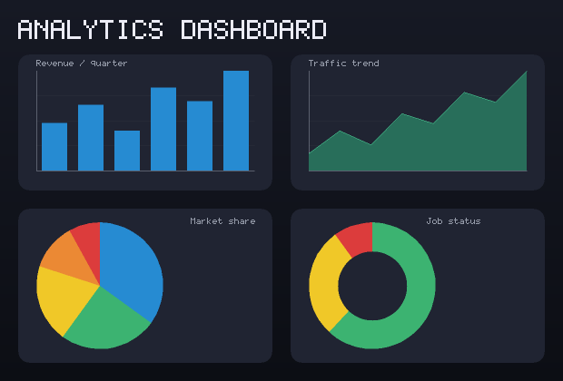
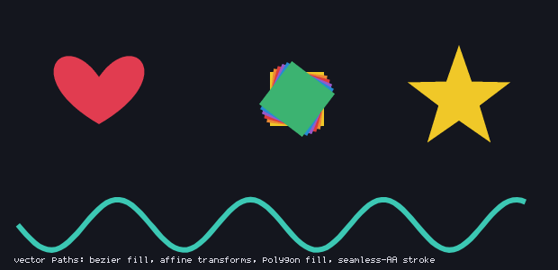
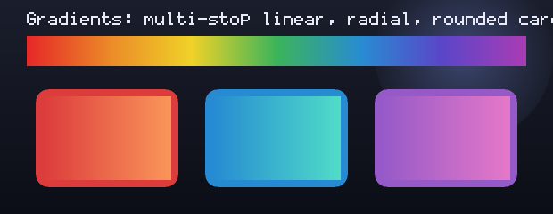
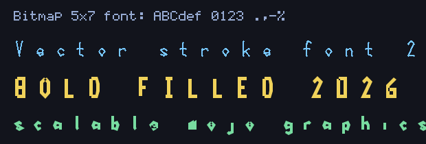
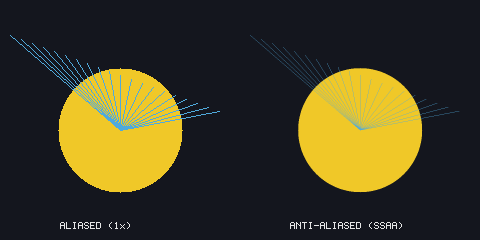

# graphics — pro-class 2D graphics for Mojo (100% Mojo)

A from-scratch 2D graphics library: an RGBA framebuffer, integer + anti-aliased
primitives, scanline polygon fill, **vector paths with affine transforms and Bézier
curves** (fill/stroke), gradients, a built-in bitmap font, a full chart suite
(bar/line/area/scatter/pie/donut), and a **real PNG encoder** so the output opens
in any viewer. No image or compression library is linked — the PNG's zlib stream is
a real **DEFLATE** compressor (LZ77 + fixed *and* dynamic Huffman, smaller wins)
with CRC-32 / Adler-32, all implemented here. A 620x420 dashboard PNG is ~9.5 KB —
**~110x smaller than raw RGBA**.

Anti-aliasing comes two ways: **native analytic AA fills** (`fill_polygon_aa` /
`fill_path_aa` — a coverage rasterizer, smooth edges at 1x, no extra memory) and a
Wu AA line; or **supersampling** for everything at once (draw at Nx, then
`Canvas.downsampled(N)` smooths every primitive, fill, stroke, and label).

## Gallery

Every image below was produced by this library and saved by its own PNG encoder
(the generator is `graphics/` demos; see the test suite for verification).

**Charts** — bar / area / pie / donut in gradient rounded panels:



**Vector paths** — cubic-Bézier fill, affine transforms, polygon fill, seamless AA stroke:



**Gradients** — multi-stop linear, radial, rounded gradient cards:



**Text** — bitmap 5x7, scalable vector stroke, and bold filled fonts:



**Anti-aliasing** — aliased (1x) vs supersampled:



## Modules

| Module | What it is |
|---|---|
| `color.mojo` | `Color` (RGBA8) + `rgb`/`rgba` + a named palette. |
| `canvas.mojo` | `Canvas` — heap RGBA8 framebuffer (owns + frees its buffer). `set_pixel` (alpha blend) / `put_pixel` (direct), `get_pixel`, `clear`, `fill_rect`, **`set_clip`/`reset_clip`** (scissor rect — everything clips to it), **`blit`** + **`blit_scaled`** (nearest **or bilinear**), **`downsampled(factor)`** (box-filter SSAA). |
| `draw.mojo` | Primitives: `line` (Bresenham) + **`line_aa`** (Wu), `hline`/`vline`, `rect`, `circle`/`fill_circle`, `fill_polygon` + **`fill_polygon_aa`** (analytic AA), `fill_triangle`, `polygon`, `rounded_rect_fill`. |
| `transform.mojo` | `Affine` 2x3 matrix — `identity`/`translate`/`scale`/`rotate` + `then` composition. |
| `path.mojo` | `Path` (`move_to`/`line_to`/`quad_to`/`cubic_to`/`close`, Béziers flattened), `transformed(Affine)`, `fill_path` + **`fill_path_aa`** (analytic AA, even-odd holes), **`stroke_path`** (width + **caps** butt/round/square + **joins** round/bevel/miter) + **`stroke_path_dashed`** + **`stroke_outline_aa`** (seamless single-outline AA stroke). |
| `gradient.mojo` | `lerp_color`, `linear_gradient` (h/v), `radial_gradient`, **`fill_triangle_gradient`** (Gouraud), **`linear_gradient_multi`/`radial_gradient_multi`** (N color stops). |
| `font5x7.mojo` | A 5x7 bitmap font (ASCII 32..126; digits, **A-Z, a-z**, chart punctuation). Auto-generated from ASCII-art. |
| `text.mojo` | `draw_char` / `draw_text` (per-pixel `scale`) + `text_width` / `text_height`. |
| `vfont.mojo` | A **scalable stroke (vector) font** — `draw_text_vector` (Hershey-style; 0-9, A-Z, a-z) + **`draw_text_filled`** (bold filled glyphs via the AA outline stroker, with counters) + `text_vector_width`. |
| `chart.mojo` | `bar_chart`, `line_chart`, `area_chart`, `scatter`, **`pie_chart`**, **`donut_chart`** — axes, gridlines, labels. |
| `deflate.mojo` | `deflate(raw)` — real DEFLATE (LZ77 hash-chain + **fixed and dynamic Huffman**, length-limited codes, smaller block wins; RFC 1951). Dynamic codes are Kraft-validated and fall back to fixed if invalid, so output is always a valid stream. |
| `inflate.mojo` | `inflate(data)` — RFC 1951 DEFLATE **decompressor** (stored / fixed / dynamic Huffman + full LZ77 back-references); `zlib_inflate(data)` strips the zlib header and **verifies the Adler-32**. Round-trips `deflate` 9/9 and matches Python `zlib` byte-for-byte. |
| `png.mojo` | `write_png` (RGBA) + **`write_png_gray`** (grayscale) + **`write_png_indexed`** (≤256-color palette, auto-falls back to RGBA) + **`write_png_interlaced`** (Adam7) — all DEFLATE-compressed with CRC-32 + Adler-32, via Mojo's native binary file API. |
| `texture.mojo` | `to_rgba_list(canvas)` — RGBA8 `List[UInt8]` for a GPU texture upload (e.g. MojoUI `Backend.make_texture_rgba`). |

## Example

```mojo
from graphics.canvas import Canvas
from graphics.color import rgb
from graphics.chart import bar_chart
from graphics.text import draw_text
from graphics.png import write_png

var c = Canvas(300, 180)
c.clear(rgb(18, 20, 28))
draw_text(c, 12, 10, String("SALES"), rgb(240, 200, 40), 2)
var v = List[Float64]()
for x in [42.0, 58.0, 35.0, 73.0, 61.0]: v.append(x)
bar_chart(c, 30, 35, 250, 120, v, rgb(38, 139, 210), rgb(180, 180, 190))
write_png("sales.png", c)
```

## Verified

Every batch is checked by reading pixels back from the `Canvas` (and the PNGs are
validated externally with `file` + PIL, then viewed):

- **canvas/png** 10/10 — fills, alpha blend, and a PNG whose every drawn pixel
  matches under PIL (`file`: *PNG image data, 8-bit/color RGBA*).
- **draw** 14/14 — on/off-line pixels, rect outline, circle perimeter/center, disc.
- **text** 14/14 — glyph structure (`-`, `I`, space, lowercase `o`/`g`) and metrics.
- **chart** 7/7 — baseline, bar scaling, line min→baseline / peak→top, scatter.
- **chart2** 9/9 — pie slices land in the right quadrants/colors, donut hole, area
  filled below / clear above.
- **aa** 5/5 — downsample box-average exact; Wu line has partial-coverage pixels, a
  hard line does not.
- **aafill** 6/6 — analytic AA fill: interior full / exterior empty / edge has
  partial-coverage pixels, hard fill has none; AA path (Bézier) fill too.
- **polygon** 10/10 — convex/triangle fill, concave even-odd notch correctness.
- **path** 10/10 — fill, affine translate, ring HOLE (even-odd), Bézier-arch fill,
  stroke width.
- **effects** 11/11 — lerp midpoint, gradient edges/mid, radial center/edge,
  rounded-corner clipping, blit offset.
- **clip** 14/14 — scissor restricts fills/primitives (edge inclusive/exclusive),
  reset_clip restores, blit_scaled upscales by blocks and respects the clip.
- **stroke** 13/13 — butt/round/square caps, round/bevel/miter joins (miter tip
  reaches the sharp point where bevel cuts it), dashed on/off pattern.
- **scale_grad** 6/6 — bilinear scaling has smooth mids (nearest has none);
  Gouraud triangle vertices ~ their colors, centroid is a blend.
- **pngmode** 2/2 — grayscale ('L') / palette ('P') write + >256-color fallback
  (PIL: palette pixels identical to RGBA; gray 676 B / palette 607 B vs 1489 B).
- **vfont** 5/5 — stroke font scales (large glyph ≫ small), dense vs thin glyphs,
  width metrics, multi-char string.
- **gradmulti** 7/7 — multi-stop linear (red/green/blue stops + quarter blend) +
  radial; fill_triangle_aa partial edges; lowercase vector glyphs render.
- **strokeaa** 6/6 — seamless outline-AA stroke: centerlines full, outer corner
  filled (no seam gap), AA edges. (The image that surfaced it now zlib-inflates
  exact, after the dynamic-Huffman validity fix.)
- **filled_il** 5/5 — filled/bold 'O' has ink + a hollow counter (center hole),
  'I' renders, Adam7 interlaced writer runs (PIL: interlaced decodes pixel-
  identical to non-interlaced).
- **deflate** 6/6 — compression ratios incl. a skewed-distribution case only the
  dynamic block passes; **losslessness verified externally** by feeding the stream
  to Python `zlib.decompressobj(-15)` (round-trip exact, fixed beaten by dynamic
  346→255 / 329→123) and by PIL decoding the PNGs pixel-correct.
- **texture** 3/3 — Canvas→RGBA `List[UInt8]` byte-exact vs `get_pixel`.

(163 assertions across 20 test files, all passing.)

## Using with MojoUI (offscreen → texture)

MojoUI renders shapes on the GPU (tessellation), so `graphics` doesn't replace
its renderer — it provides **offscreen 2D content** (charts, custom drawings) as a
texture. Render into a `Canvas`, convert with `to_rgba_list`, then upload + draw:

```mojo
var cv = Canvas(W, H)
bar_chart(cv, ...)                                  # draw on the CPU
var px = to_rgba_list(cv)
var tex = Backend.make_texture_rgba(Int32(W), Int32(H), px)   # MojoUI
Backend.draw_image_rect(Rect(x, y, W, H), tex, white)         # MojoUI
```

A runnable example lives in the MojoUI repo (`examples/chart_texture.mojo`); it
compiles against MojoUI's real `Backend` API and runs the CPU rasterization
(the GPU upload is compile-proved — no live GL context in CI).

```bash
# from the repo root (-I .)
pixi run mojo run -I . graphics/tests/canvas_png_test.mojo
pixi run mojo run -I . graphics/tests/draw_test.mojo
pixi run mojo run -I . graphics/tests/text_test.mojo
pixi run mojo run -I . graphics/tests/chart_test.mojo
pixi run mojo run -I . graphics/tests/deflate_test.mojo
pixi run mojo run -I . graphics/tests/texture_test.mojo
```

## Notes

- RGBA8, row-major; `Canvas` is `Movable` (not `Copyable`) so its buffer frees
  exactly once.
- PNG output is **compressed** via the real `deflate` (LZ77 + fixed/dynamic
  Huffman, smaller wins) — ~110x vs raw on the dashboard.
- The font covers ASCII digits, A-Z, **a-z**, and chart punctuation; unmapped
  codes render blank. More punctuation is an easy extension to `font5x7.mojo`.
