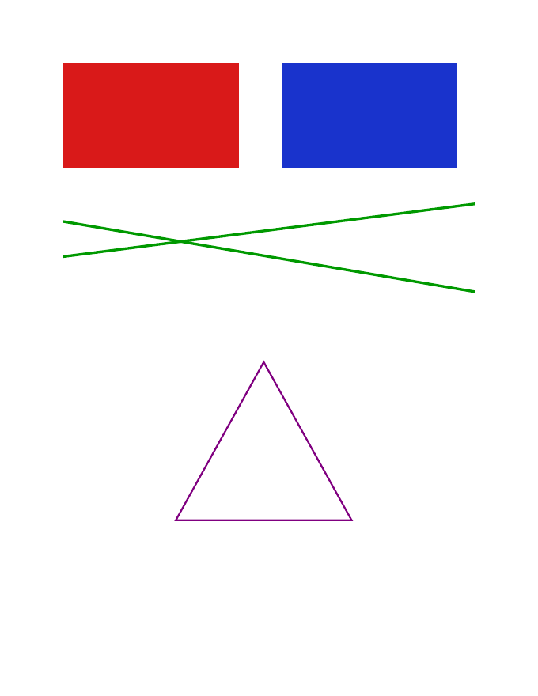
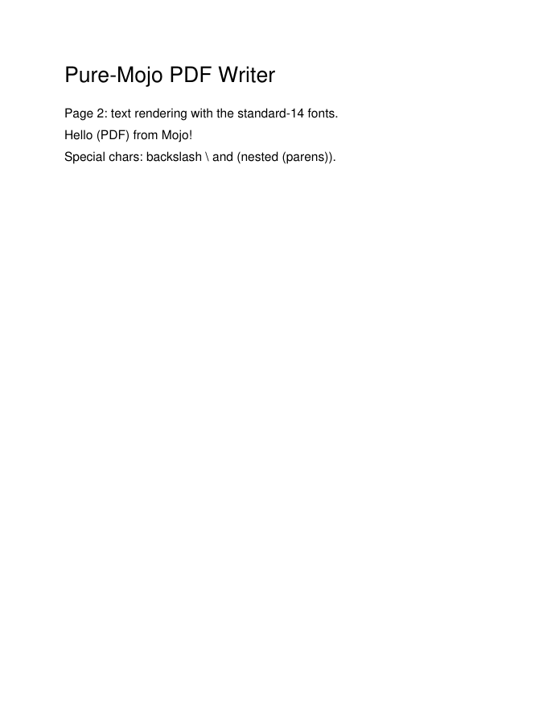

# pdf — a pure-Mojo PDF 1.7 writer (100% Mojo)

Generate real PDF files from Mojo: vector graphics, standard-14 text, **embedded
Unicode TrueType fonts** (Type0/CIDFontType2, Identity-H, with a ToUnicode CMap so
text is copyable), **AFM-driven text measurement + word wrapping**, document
metadata, **FlateDecode-compressed page streams**, gray/RGB/CMYK color,
**transparency** (ExtGState), **link annotations**, **outline bookmarks**, and
embedded raster images — all with a correct cross-reference table and trailer, so
the output opens in any viewer. No PDF/font/compression library is linked; stream
compression reuses the [`graphics`](../graphics/) DEFLATE compressor (zlib-wrapped
for `/FlateDecode`).

Built and verified with **poppler** (`pdfinfo`/`pdffonts`/`pdftotext`/`pdfimages`/`pdftoppm`),
**pypdf** (strict mode), and **fontTools** (parsing the embedded FontFile2) as
independent oracles, plus a byte-level audit of the xref offsets and stream
`/Length` fields across a 32-page production-feature stress file.

## Showcase (rendered from a generated PDF via `pdftoppm`)

| Vector graphics | Standard-14 text | Embedded image |
|---|---|---|
|  |  |  |

## Modules

| Module | What it is |
|---|---|
| `objects.mojo` | Byte-level PDF object serialization into `List[UInt8]`: `append_str/int/real`, `pdf_name`, `pdf_literal_string` (escapes `( ) \`), `pdf_hex_string`. Reals are written without exponent notation (PDF forbids `1e5`). |
| `document.mojo` | `PdfDoc` — registers indirect objects, builds the catalog + page tree, and `save(path)` writes the header, body, **byte-exact xref table**, and trailer. `add_object`, `add_stream_object`, `add_page(w, h, content, resources)`, **`add_page_ext`/`add_page_flate`** (page `/Annots` + optional `/FlateDecode` of the content stream), **`set_info`** (Title/Author/Subject/Creator), **`set_outlines`** (Catalog `/Outlines`). Encryption: **`save_encrypted`** (RC4 V2/R3/128), **`save_encrypted_aes128`** (AESV2 V4/R4/128), **`save_encrypted_aes256`** (AESV3 V5/R6/256, SHA-256/384/512 key derivation). Compression: **`save_xref_stream`** (PDF-1.5 XRef stream) and **`save_compressed`** (object streams `/ObjStm` + XRef stream). Archival: **`enable_xmp`** / **`save_with_xmp`** (XMP metadata packet + document `/ID`) and **`save_pdfa`** (PDF/A-2b structure: embedded sRGB ICC OutputIntent + `pdfaid` XMP + `/ID`). |
| `content.mojo` | `Content` — a content-stream builder: `move_to/line_to/rect/close_path`, `fill/stroke/fill_stroke`, `set_fill_rgb/set_stroke_rgb`, `set_line_width`, `save_state/restore_state`, `raw`. (PDF origin is bottom-left, y up.) |
| `text.mojo` | Standard-14 text operators on a content buffer: `begin_text/end_text`, `set_font`, `text_pos`, `show_text` (**UTF-8 → WinAnsi transcode** + escaping), and `standard_font_object` (Helvetica/Times/Courier). |
| `ttf.mojo` | `TtfFont` — a minimal TrueType parser: `load_ttf(path)`, `units_per_em`, `num_glyphs`, `gid_for(codepoint)` (cmap format 4/12), `advance_1000(gid)`. |
| `font_embed.mojo` | **Embed a TrueType font** as a Type0/CIDFontType2 composite (Identity-H) with FontFile2 (FlateDecode), ToUnicode CMap and `/W` widths: `embed_font(doc, font, name, codepoints) -> EmbeddedFont`, `show_text_unicode(buf, font, emb, s)` (emits `<HHHH> Tj`; **raises** if a codepoint wasn't embedded — no silently unextractable text), `collect_codepoints`/`add_codepoints`. |
| `metrics.mojo` | AFM glyph-width tables (Helvetica/Courier/Times-Roman, 1000-unit em): `char_width_1000(font, cp)`, `text_width(font, size, s)`. |
| `layout.mojo` | `wrap_text(s, font, size, max_width)` — greedy word wrap; `align_x(line, font, size, box_x, box_w, mode)` — left/center/right (0/1/2). |
| `justify.mojo` | **Inter-word justification** via the `TJ` array operator: `show_justified_line(buf, font, size, line, box_w)` distributes slack across gaps so the line fills `box_w` exactly; `render_justified_paragraph(...)` justifies all lines but the last. |
| `subset.mojo` | **TrueType font subsetting** — `subset_ttf(font, codepoints)` rebuilds `glyf`/`loca`/`cmap` keeping only the used glyphs (+ composite closure); `embed_subset_font(doc, font, name, codepoints)` subsets then embeds. (DejaVuSans 760 KB → ~198 KB.) Emits a **cmap format 12** subtable when astral (>U+FFFF) codepoints are used (format 4 for BMP-only). |
| `md5.mojo` / `rc4.mojo` | Pure-Mojo **MD5** (RFC 1321) and **RC4** — verified against published test vectors. |
| `sha256.mojo` / `aes.mojo` | Pure-Mojo **SHA-256** (FIPS 180-4) and **AES-128/256 + CBC** (FIPS-197) — verified against NIST/FIPS known-answer vectors + a Python `cryptography` cross-check; back the AES encryption paths. (SHA-384/512 for the R6 key derivation live in `document.mojo`.) |
| `bigint.mojo` / `rsa.mojo` / `asn1.mojo` | Arbitrary-precision `BigInt` (modexp + **`bi_modinv`**, RSA-2048), **RSA** PKCS#1 v1.5 SHA-256 signing, and a DER **ASN.1** encoder. RSA output verifies with `openssl` (byte-identical to openssl's own signature). |
| `keygen.mojo` / `x509.mojo` | **RSA key generation** (`gen_rsa(bits)` — small-prime sieve + Miller-Rabin, PKCS#1 DER) and **self-signed X.509 certificate** generation. `openssl rsa -check` → *RSA key ok*; `openssl verify` on the self-signed cert → *OK*. |
| `ec.mojo` / `sign_ec.mojo` | **NIST P-256 / ECDSA** (Jacobian point math, Fermat inverse) + `ecdsa_sign` and `sign_pdf_ecdsa` (ECDSA-with-SHA256 CMS). `openssl dgst -verify` → *Verified OK*; `pdfsig` → *Signature is Valid*. |
| `sign.mojo` | **Digital signatures** — `sign_pdf(...)` appends an incremental update with a `/Sig` (`adbe.pkcs7.detached`), `/ByteRange`, an invisible signature widget + `/AcroForm`, and a CMS/PKCS#7 SignedData (signed attributes, RSA-SHA256). Validated by **`pdfsig`** ("Signature is Valid. Total document signed") and **`openssl cms -verify`**. (ECDSA variant in `sign_ec.mojo`.) |
| `reader.mojo` | A **PDF reader/parser**: classic xref tables, **cross-reference streams**, **object streams** (`/ObjStm`), and `/Prev`-chained sections (+ PNG/TIFF predictors). `PdfReader.open`, `get_object` (direct or ObjStm), `get_stream_data` (auto-inflates `/FlateDecode`), `trailer_value`, `page_count`. Plus **`open_encrypted(path, password)`** — authenticates the password and **decrypts** RC4 / AESV2 / AESV3 strings + streams (recovers the exact text). Reads this lib's output and external pikepdf/qpdf PDFs. |
| `page.mojo` | `Page` facade — `new_page(w, h)`, `add_font`/`add_xobject` (auto `/F1`,`/Im1` names), `resources_bytes`, `finish(doc, flate)`. |
| `extras.mojo` | Color + state ops (`set_fill_gray/cmyk`, `set_stroke_gray/cmyk`, `set_dash`, `set_line_cap/join`, `apply_gstate`) and object builders (`extgstate_object` for `/ca`,`/CA` transparency; `link_uri_annotation`; `outline_item_object`/`outlines_root_object` for bookmarks). |
| `image.mojo` | `image_xobject_stream(w, h, rgb)` — an RGB raster as a `/FlateDecode` Image XObject (zlib-wrapped DEFLATE + Adler-32); `draw_image` places it via the `cm` matrix. |

## Example

```mojo
from pdf.document import PdfDoc
from pdf.content import Content
from pdf.text import begin_text, end_text, set_font, text_pos, show_text, standard_font_object
from pdf.objects import append_str, append_int

var doc = PdfDoc()
var fnum = doc.add_object(standard_font_object("Helvetica"))   # add font first
var c = Content()
c.set_fill_rgb(0.86, 0.20, 0.18); c.rect(72.0, 600.0, 200.0, 120.0); c.fill()
begin_text(c.b); set_font(c.b, "F1", 24.0); text_pos(c.b, 72.0, 740.0)
show_text(c.b, String("Hello (PDF) from Mojo — café 50% off"))
end_text(c.b)
var res = List[UInt8]()
append_str(res, "<< /Font << /F1 "); append_int(res, fnum); append_str(res, " 0 R >> >>")
_ = doc.add_page(612.0, 792.0, c.bytes(), res)   # Letter
doc.save("hello.pdf")
```

## Verified

- **Demo** (`pdf/tests/demo.mojo` → 3-page PDF): `pdfinfo` reports 3 pages; `pdftotext`
  returns the exact text incl. the escaped `Hello (PDF) from Mojo!`; `pdfimages`
  lists the embedded `64 48 rgb` image; all three pages render under `pdftoppm`.
- **Module tests**: objects 12/12, content 8/8, text+image 4/4, a 1-page doc test.
- **Skeptic audit** (independent): a byte-level check confirmed **every xref offset
  lands exactly on its `N 0 obj` header**, every xref entry is exactly 20 bytes,
  every stream `/Length` equals the actual byte count, and the catalog→pages→page
  tree + `/Count` are consistent — across a **34-page** adversarial stress file.
  **pypdf (strict)** opens both PDFs with no warnings, extracts text per page, and
  decodes the image XObjects to PIL.
- **Non-ASCII**: `café — 50% off` round-trips through `pdftotext` (UTF-8 → WinAnsi).
- **Production demo** (`pdf/tests/production_demo.mojo` → `/tmp/pdf_pro.pdf`): one
  2-page document exercising every feature — metadata, an **embedded Unicode TTF**
  (DejaVuSans), a wrapped+aligned paragraph, FlateDecode page streams, gray/CMYK/RGB
  color, ExtGState transparency, a link annotation, and a 2-item bookmark tree.
  `pdffonts` reports the embedded font `emb=yes` (CID TrueType, Identity-H);
  `pdftotext`/pypdf extract the Unicode line (`Helló Ünïcödé — Mojo 2026 © ®`) and
  all wrapped lines on **both** pages; `pdfinfo` shows the metadata; fontTools parses
  the embedded FontFile2 (6253 glyphs). `show_text_unicode` **raises** on a
  codepoint that wasn't embedded rather than emitting unextractable text.
- **Production stress** (`pdf/tests/prod_stress.mojo` → `/tmp/pdf_prostress.pdf`):
  **32 pages**, each FlateDecode with embedded-font Unicode + a wrapped paragraph +
  a link annot + color; a **32-bookmark** outline; long/empty/`( ) \`-special
  strings. The byte-auditor reports **0 critical / 0 major** (every xref offset,
  every `/Length`, every flate stream valid); pypdf-strict opens all 32 pages, all
  32 bookmark destinations resolve, every page extracts.

```bash
# from the repo root (-I .)
pixi run mojo run -I . pdf/tests/objects_test.mojo
pixi run mojo run -I . pdf/tests/content_test.mojo
pixi run mojo run -I . pdf/tests/textimg_test.mojo
pixi run mojo run -I . pdf/tests/layout_test.mojo      # AFM metrics + word wrap (14/14)
pixi run mojo run -I . pdf/tests/extras_test.mojo      # color/gstate/links/outlines (25/25)
pixi run mojo run -I . pdf/tests/font_embed_test.mojo  # -> /tmp/font_embed.pdf
pixi run mojo run -I . pdf/tests/demo.mojo             # -> /tmp/pdf_showcase.pdf
pixi run mojo run -I . pdf/tests/adversarial.mojo      # -> /tmp/pdf_adv.pdf (34 pages)
pixi run mojo run -I . pdf/tests/production_demo.mojo  # -> /tmp/pdf_pro.pdf
pixi run mojo run -I . pdf/tests/prod_stress.mojo      # -> /tmp/pdf_prostress.pdf (32 pages)
```

## Advanced (also verified, this lib)

- **Inter-word justification** (`pdf/tests/justify_test.mojo` → `/tmp/pdf_justify.pdf`):
  a paragraph justified via `TJ`; pdftotext returns all 42 words in order, and the
  parsed `TJ` adjustments sum to the exact slack so every line fills the box to
  0.0000 pt.
- **Font subsetting** (`pdf/tests/subset_test.mojo` → `/tmp/pdf_subset.pdf`):
  DejaVuSans subset to one string — **fontTools** loads the subset, the unused
  glyphs are empty, `pdffonts` shows `emb yes`, pdftotext returns the Unicode, and
  the embedded font drops **760 KB → ~198 KB**.
- **Encryption** (`pdf/tests/encrypt_test.mojo` → `/tmp/pdf_enc.pdf`): RC4 V2/R3
  128-bit. pypdf opens it `is_encrypted`, **refuses text without the password**, and
  after `decrypt("userpw")` extracts the exact text + title; poppler agrees
  (`pdftotext -upw` works, plain fails; `pdfinfo`: *Encrypted: yes … algorithm:RC4*).
  MD5 + RC4 are verified against published test vectors (`crypto_test.mojo`).
- **Cross-reference stream** (`pdf/tests/xrefstream_test.mojo` →
  `/tmp/pdf_xrefstream.pdf`): a PDF-1.5 `/Type /XRef` stream instead of a classic
  table; `pdfinfo` reports version 1.5 / 2 pages and pypdf (strict) reads both.
- **Reading back** (`pdf/tests/reader_test.mojo` + `reader2_test.mojo` +
  `inflate_test.mojo`): a pure-Mojo DEFLATE **decompressor** (`graphics/inflate.mojo`,
  round-trips the compressor 9/9 and matches Python `zlib`) powers a `PdfReader` that
  parses classic tables **and** cross-reference streams, object streams, and
  `/Prev`-chains — verified against this lib's output *and* external pikepdf/qpdf PDFs
  (the ObjStm-packed Catalog resolves).

## Enterprise (verified, this lib)

- **AES encryption** (`pdf/tests/aesenc_test.mojo`): **AESV2** (V4/R4, 128-bit) and
  **AESV3** (V5/R6, 256-bit, ISO 32000-2 Algorithm 2.B with SHA-256/384/512). pypdf
  decrypts both with the user *and* owner password and extracts the exact text; reading
  without a password is blocked; `pdfinfo` reports *algorithm:AES* / *AES-256*. SHA-256
  + AES are verified against FIPS known-answer vectors (`sha256_test`, `aes_test`).
- **Digital signatures** (`pdf/tests/sign_test.mojo` + `sign_verify.sh` →
  `/tmp/pdf_signed.pdf`): a detached CMS/PKCS#7 signature via an append-only
  incremental update (original bytes byte-identical). **`pdfsig`**: *"Signature is
  Valid. Total document signed"*; **`openssl cms -verify`**: success. The pure-Mojo
  RSA/PKCS#1 signer is verified by `openssl dgst -verify` → *Verified OK*
  (`rsa_test` + `rsa_verify.sh`).
- **Object-stream compression** (`pdf/tests/compressed_test.mojo`): `save_compressed`
  packs plain objects into an `/ObjStm` + writes an XRef stream — a sample drops
  2137 → 1365 bytes; pypdf-strict reads all pages and resolves the ObjStm-packed
  Catalog; `pdfinfo` reports PDF 1.5.
- **XMP metadata + `/ID`**: `enable_xmp` emits a `/Metadata` XMP packet and a document
  `/ID`; pypdf reads `dc:title`, `exiftool` shows the XMP title, `/ID` is present.
- **In-library RSA keygen + X.509** (`pdf/tests/keygen_test.mojo`): `gen_rsa` +
  `make_self_signed_cert` — `openssl rsa -check` → *RSA key ok*, `openssl verify` on the
  self-signed cert → *OK*, and a signature from the generated key → *Verified OK*
  (512-bit ~1 s, 1024-bit ~6 s; pure-Mojo bigint, size is a parameter).
- **ECDSA (P-256)** (`pdf/tests/ecdsa_test.mojo`): raw ECDSA → `openssl dgst -verify`
  *Verified OK* (+ `2G`/`nG` curve sanity); an ECDSA-signed PDF → `pdfsig` *Signature is
  Valid. Total document signed* + `openssl cms -verify` success.
- **Reader decryption** (`pdf/tests/reader_decrypt_test.mojo`): `open_encrypted` recovers
  the exact text from this lib's RC4, AESV2 and AESV3 outputs (cross-checked against
  pypdf), and a wrong password raises.
- **Astral subset cmap** (`pdf/tests/subset_astral_test.mojo`): a format-12 subtable —
  fontTools reads `(3,10)` `U+1F600 → gid`, and `AB😀` round-trips through pdftotext and
  pypdf; BMP-only inputs stay format 4 (regression checked).
- **PDF/A-2b** (`pdf/tests/pdfa_test.mojo`): `save_pdfa` — embedded sRGB ICC OutputIntent
  (`/S /GTS_PDFA1`, `/N 3`), `pdfaid:part 2 / conformance B` XMP, document `/ID`, all
  fonts embedded. Structure verified by pypdf + `pdffonts` + `exiftool`. **veraPDF is not
  installed in this environment, so full PDF/A conformance was not machine-certified** —
  the checks here are structural.

## Scope / limitations (honest)

- Three text paths: standard-14 **WinAnsi** (glyphs outside CP1252 become `?`),
  **embedded TrueType** Identity-H for full Unicode (CIDFontType2 + ToUnicode), and
  the same **subset**. Subsetting rebuilds `glyf`/`loca`/`cmap` but keeps the
  original glyph numbering (unused `glyf` entries zeroed) — so it shrinks the file
  without renumbering; the subset `cmap` is format 4 (BMP), astral codepoints would
  need format 12.
- Encryption covers **RC4** (V2/R3) and **AES** (AESV2 128-bit, AESV3 256-bit), with
  reader-side decryption for all three. Signatures are **RSA** *and* **ECDSA (P-256)**
  (PKCS#1 v1.5 / ECDSA, SHA-256); keys+certs can be generated in-library (RSA) or
  supplied. No timestamp authority (RFC 3161) / LTV; no signature *appearance* stream.
- **PDF/A-2b** output is structurally built and parser-checked but **not** veraPDF-
  certified here (veraPDF absent). PDF/A-2a/2u (tagging) is not implemented.
- The reader handles classic tables, xref streams, object streams, `/Prev` chains and
  encrypted input, but is not a full object-graph library (single-filter streams).
- The full surface (page tree / font embedding+subset incl. astral / annots / outlines /
  RC4+AES encryption + decryption / xref+object streams / XMP / RSA+ECDSA signatures /
  RSA keygen + X.509 / PDF/A structure) is verified under strict parsers, fontTools,
  `pdfsig`, `openssl`, `exiftool`, pikepdf, and adversarial stress (**32 tests**).
