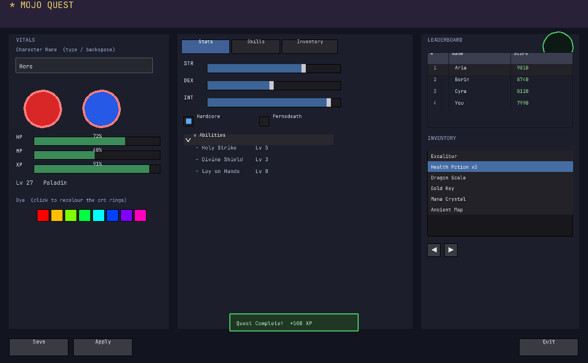

# ui — an immediate-mode GUI toolkit for Mojo

An **immediate-mode widget toolkit, in 100% Mojo.** You declare the UI every frame;
the toolkit tracks hot/active widgets, hashes IDs, applies a style stack, and draws.
Immediate-mode means there's no retained widget tree — the same primitives a GUI
ultimately rasterizes (filled rects / lines / triangles + a font atlas + input
polling) are issued each frame from plain function calls.

Built on the **MojoGUI** C rendering backend (`librender.so`, GL + stb_truetype)
via FFI. Every module here is verified two ways (see **Verification** below):
**logic-gated** (synthetic input injected as args → asserted against first-principles
values) and **render-gated** (`glReadPixels` reads the drawn fill colour back).



*One frame composing ~12 of these modules — orbs, bars, tabs, sliders, a skill tree,
a leaderboard table, an inventory list, a colour palette, a popup, and a decorative
HUD — rendered and `glReadPixels`-verified.*

## Modules

| Module | Provides |
|---|---|
| `core_widgets.mojo` | `UiContext` + `button` / `checkbox` / `radio` / `slider_float` / `begin_child` (scroll) / `tooltip` / `combo` |
| `core_layout.mojo` | the 3 ergonomic systems: **layout cursor** (`same_line`/`new_line`/`indent`/`group`/`separator`/`push_item_width`), hashed **ID stack** (FNV-1a `push_id`/`pop_id`), **style/theme stack** (`push_style_color`/`push_style_var`) |
| `widget_pack.mojo` | `drag_float`/`drag_int`/`slider_int`, `tree_node`/`collapsing_header`, menu bar + `menu_item`, `tab`, `progress_bar`, `color_button`, `begin/end_disabled`, `bullet_text`, `list_clipper` (virtualized rows) |
| `widget_variants.mojo` | vector `slider_float2/3/4` + `drag_float2/3/4`, `input_float`/`input_int`/multiline, `selectable`, `list_box`, `arrow_button`/`small_button`/`invisible_button`, `slider_angle` |
| `input_text.mojo` | editable `TextInput` field (on the backend char-input queue) |
| `tables.mojo` | `begin_table`/columns (fixed + stretch)/`table_headers_row`/cell clipping/row backgrounds/borders |
| `window.mojo` | real **movable + resizable** windows — title-drag, resize grip, collapse, clipped content, scrollbar |
| `popup.mojo` | `open_popup`/`begin_popup`/`begin_popup_modal` (dimmed backdrop) + right-click context menu |
| `color_picker.mojo` | `hsv_to_rgb`/`rgb_to_hsv` (piecewise-linear, no trig), SV square + hue bar picker, RGB `color_edit` |
| `draw_list.mojo` | a batch `DrawList` — accumulate rects → triangles, flush in **one** FFI call |
| `draw_list_paths.mojo` | full retained-path drawing on the batch: line/rect/rounded/circle/triangle/bezier/polyline (baked unit-circle, no trig) |
| `curve_editor.mojo` | keyframe **curve editor** (multi-curve, add/move/delete points, smoothstep) |
| `node_graph.mojo` | **node graph** editor (nodes, pins, bezier links, drag to connect) |

## Backend requirement

The toolkit calls the **MojoGUI** backend (github.com/CodeAlexx/MojoGUI-UI,
`mojo-gui/c_src/rendering_with_fonts.c` → `librender.so`). It uses the standard
primitives (`set_color`, `draw_filled_rectangle`, `draw_line`, `draw_filled_circle`,
`draw_text`, `draw_image`, mouse/key polling) **plus** these additions (in that repo):
`set_clip_rect`/`clear_clip_rect` (scissor), `draw_filled_triangle`,
`draw_triangles_batch` (one-call batch), `get_char` (Unicode input queue),
`get_scroll_y` (wheel).

## Build / run

```bash
# build librender.so once (from the MojoGUI-UI repo):
cc -O2 -fPIC -shared mojo-gui/c_src/rendering_with_fonts.c -o librender.so -lglfw -lGL -lm
# build a Mojo app against the toolkit + backend:
pixi run mojo build --optimization-level 2 -I path/to/ui \
  -Xlinker -L<dir> -Xlinker -lrender -Xlinker -lm -Xlinker -rpath -Xlinker <dir> \
  app.mojo -o app
```
Call `initialize_gl_context(w,h,title)` then `load_default_font()`; each frame:
`frame_begin()` → declare widgets on the contexts → `frame_end()`. Use a widget's
`set_input(mx,my,down)` for synthetic input (tests) or `pump_live_input()` for the
live window. See `demo/game_screen.mojo` for a full composition.

## Verification (measured)

Every module ships a `def main()` self-test that injects synthetic input and prints
labelled values checked against first-principles expectations, e.g.: layout
`B_x = A_x + A_w + spacing = 33.0`; `hsv_to_rgb(120,1,1) = (0,1,0)`; table col-x
`{0,60,180}`; window title-drag moves by the exact injected delta; `input_int`
'4''2' → 42 → step → 43; slider mouse-x 25%/50%/75% → 25/50/75; draw-list 3 rects in
1 FFI call. Plus independent `glReadPixels` render gates per module and for the
game-screen demo. Idioms target **Mojo 1.0.0b1**.

## Coverage / honesty

This covers the high-frequency core of an immediate-mode UI (the widgets that are the
bulk of real-app calls) plus 5 larger subsystems: tables, movable/resizable windows,
popups & modals, a colour picker, and a retained draw-list path API. It is a focused,
usable toolkit — **not** an exhaustive one. Still out of scope: IME / text
composition, docking / multi-window, settings (`.ini`) persistence, and a profiled
perf benchmark of the batch (the one-FFI-call reduction is structural; frame-time is
unmeasured).
